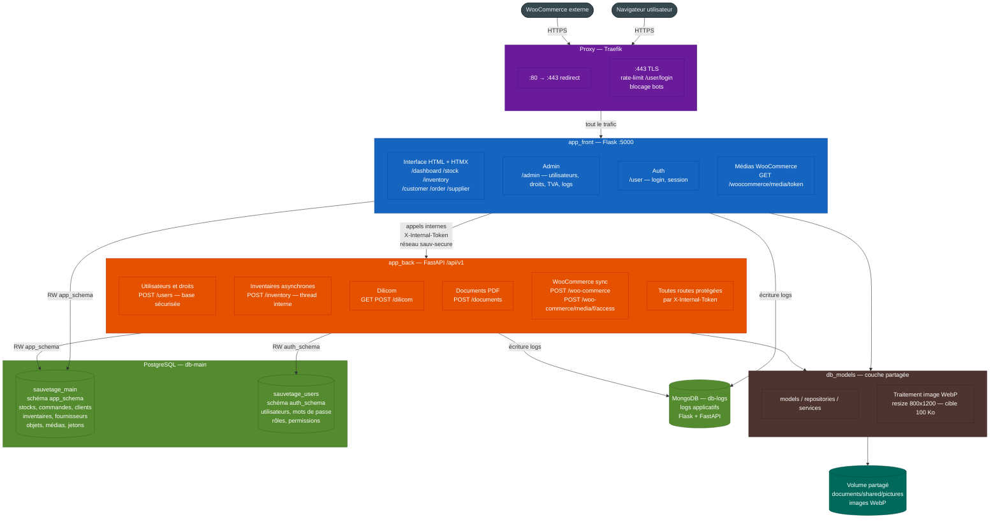
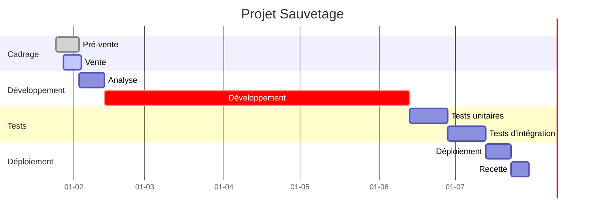

# Sauvetage

Projet d'outil centralisé pour une librairie :

- ERP,
- Site e-commerce

## Architecture

### Rôle de chaque composant

#### Proxy — Traefik

- Unique point d'entrée réseau (ports 8080/8443 en dev, 80/443 en prod).
- Redirige HTTP → HTTPS, bloque les bots sur les chemins sensibles.
- Applique un rate-limit strict sur `/user/login` (5 req / 10 min).
- Route tout le trafic HTTPS vers **app-front** (Flask).

#### app_front — Flask

- Rendu HTML server-side et fragments HTMX.
- Modules ERP : dashboard, stock, inventaire, commandes, clients, fournisseurs.
- Gestion des sessions utilisateur et contrôle des droits.
- Administration : utilisateurs, rôles, TVA, consultation des logs.
- Service d'images par jeton (`GET /woocommerce/media/<token>`) pour WooCommerce.
- Connexion : base principale PostgreSQL en lecture/écriture, MongoDB pour les logs.

#### app_back — FastAPI

Réservé aux opérations **longues, sécurisées ou sensibles**. Toutes les routes requièrent l'en-tête `X-Internal-Token`.

| Route | Responsabilité | Base |
| --- | --- | --- |
| `POST /api/v1/users` | Création/modification d'utilisateurs et droits | sécurisée |
| `POST /api/v1/inventory` | Inventaire asynchrone (thread Python) | principale |
| `/api/v1/dilicom` | Import/export flux Dilicom | principale |
| `POST /api/v1/documents` | Génération de PDF | principale |
| `/api/v1/woo-commerce` | Synchronisation produits WooCommerce | principale |
| `POST /api/v1/woo-commerce/media/.../access` | Création de jetons images (usage unique, 1 h) | principale |

#### db_models — couche partagée

- Package Python monté dans les deux conteneurs (`app-front` et `app-back`).
- Modèles SQLAlchemy, repositories, services métier.
- Pipeline de traitement image : compression WebP, resize max 800 x 1200, qualité itérative jusqu'à < 100 Ko.

#### PostgreSQL — db-main

Serveur unique hébergeant deux bases distinctes.

| Base | Schéma | Contenu | Accès Flask | Accès FastAPI |
| --- | --- | --- | --- | --- |
| `sauvetage_main` | `app_schema` | stocks, commandes, clients, inventaires, médias, jetons | RW `user_app` | RW `user_app` |
| `sauvetage_users` | `auth_schema` | utilisateurs, mots de passe, rôles, permissions | — | RW `user_secure` |

Un troisième rôle `user_migr` (Alembic) dispose des droits DDL sur les schémas de migration des deux bases.

#### MongoDB — db-logs

- Stockage des logs applicatifs (module partagé `logs/logger.py`).
- Écrit par Flask et FastAPI via `MongoDBLogger`.
- Collections par type d'événement : `users`, `logs`, `clients`, `métiers`.

#### Volume partagé — sauv-pictures

- Monté dans `app-front` et `app-back` au même chemin `/home/root/app/documents/shared/pictures`.
- Contient les images compressées en WebP.
- FastAPI les écrit lors des uploads ; Flask les lit et les sert.

### Flux principaux

#### Flux ERP (quotidien)

1. Navigateur → Traefik → Flask
2. Flask lit/écrit `sauvetage_main` via `db_models`
3. Flask délègue les opérations longues (inventaire, PDF, Dilicom) à FastAPI via le réseau interne `sauv-secure`
4. Flask et FastAPI écrivent les événements dans MongoDB

#### Flux image WooCommerce

1. Flask (admin) appelle FastAPI : `POST /api/v1/woo-commerce/media/<filename>/access` avec `X-Internal-Token`
2. FastAPI enregistre un jeton temporaire (1 h, usage unique) dans `sauvetage_main`
3. WooCommerce télécharge l'image via `GET /woocommerce/media/<token>` (Traefik → Flask)
4. Flask vérifie le jeton, sert le fichier depuis le volume, marque le jeton consommé

#### Flux gestion des utilisateurs

1. Flask (admin) appelle FastAPI : `POST /api/v1/users` avec `X-Internal-Token`
2. FastAPI écrit dans `sauvetage_users` (schéma `auth_schema`)
3. Flask relit les droits depuis `sauvetage_main` pour les contrôles de session

## Avancement du projet

## Tests

- Documentation et instructions de test : [tests/README.md](tests/README.md)

## Documentation technique

- Gestion des images et jetons WooCommerce : [documentations/gestion_images_woocommerce.md](documentations/gestion_images_woocommerce.md)

## Contributeurs

>_Rémi Verschuur | Audit-io : Lead Manager & Développeur Fullstack_
