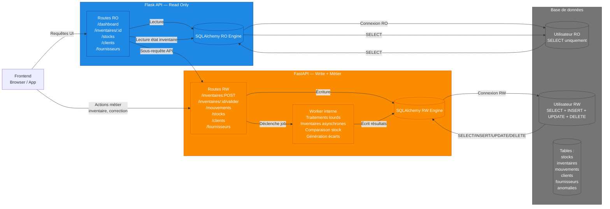

# Sauvetage

Projet d'outil centralisé pour une librairie :

- ERP,
- Site e-commerce

## Branches

- [`selling`](sales/pre-selling/260110_notes.md) : branche de pré-commercialisation du projet. CdC, définitions techniques, maquettes, prototypes, etc.
- `erp` : Développement du projet ERP de base
  - `erp-stocks` : Module de gestion des stocks
  - `erp-accounting` : Module de comptabilité
  - `erp-billing` : Module de facturation
  - `erp-crm` : Module de gestion de la relation client
- `ecommerce` : Développement du site e-commerce
  - `ecommerce-frontend` : Développement de l'interface utilisateur du site e
  - `ecommerce-backend` : Développement de la logique serveur et de la base de données
- `integration` : Intégration des modules ERP avec le site e-commerce

## Architecture

### 🧩 **Explication rapide du diagramme**

#### 🔵 Flask (RO)

- Sert l’interface utilisateur
- Ne fait que des **lectures**
- Utilise un utilisateur SQL **read-only**
- Peut être mis en cache et scalé sans risque

#### 🟠 FastAPI (RW)

- Contient **toute la logique métier**
- Gère les inventaires (complet, partiel, ponctuel)
- Gère les mouvements, corrections, anomalies
- Exécute les traitements lourds en **asynchrone interne**
- Utilise un utilisateur SQL **read-write**

#### ⚙️ Base de données

- Deux utilisateurs SQL :
  - `app_ro` → SELECT
  - `app_rw` → SELECT + INSERT + UPDATE + DELETE
- Tables partagées entre les deux services
- Cohérence garantie par FastAPI

#### 🔄 Flux d’inventaire

1. Front → Flask (RO) pour afficher l’écran
2. Front → FastAPI (RW) pour lancer l’inventaire
3. FastAPI crée un job interne
4. FastAPI écrit les résultats
5. Flask lit l’état et affiche les écarts
6. FastAPI valide et génère les mouvements

## Contributeurs

>_Rémi Verschuur | Audit-io : Lead Manager & Développeur Fullstack_
