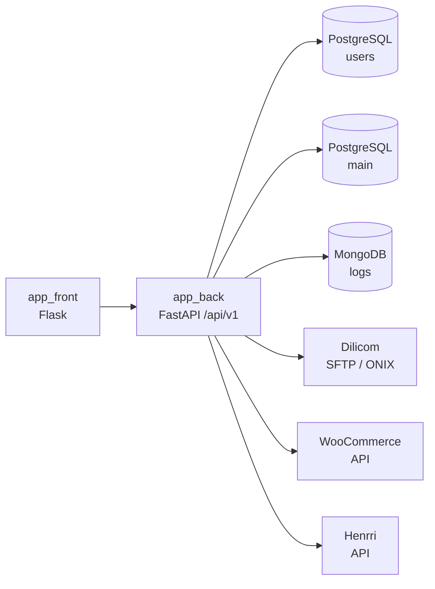

# Backend API Sauvetage

[← Retour à la documentation du projet](../README.md)

Le dossier `app_back` contient l'API backend de Sauvetage. Cette application expose les services métier et les opérations d'intégration nécessaires au frontend Flask et aux traitements automatisés. Il s'agit ici d'une API où sont déléguées les opérations longues, sensibles ou nécessitant un contrôle d'accès strict.

Ce README décrit le périmètre fonctionnel, les technologies et l'architecture du backend. Les procédures globales de démarrage, d'orchestration des conteneurs et de déploiement sont documentées au niveau du projet racine.

## Fonctionnalités

### API métier

L'API est organisée sous le préfixe `/api/v1` et expose des routeurs dédiés aux domaines suivants :

- **Utilisateurs** : authentification, validation des sessions, gestion des comptes et contrôle des permissions ;
- **Inventaire** : consultation et mise à jour des stocks et des objets ;
- **Documents** : création et génération de documents métier ;
- **Emails** : préparation et envoi de messages liés aux opérations métier ;
- **Dilicom** : traitement des référentiels, import des retours et opérations SFTP ;
- **WooCommerce** : synchronisation des produits, commandes, clients, médias et données associées ;
- **Henrri** : transactions en arrière-plan pour la synchronisation des produits et des données de facturation.

### Intégrations externes

Le backend coordonne les échanges avec plusieurs services externes :

- Dilicom via SFTP et les formats de données associés ;
- WooCommerce via son API ;
- Henrri via la bibliothèque `henrri-connect` ;
- services de messagerie pour l'envoi des emails ;
- PostgreSQL et MongoDB pour les données applicatives et les logs.

Les traitements longs ou déclenchés hors requête HTTP sont isolés dans des transactions en arrière-plan, notamment pour Dilicom et WooCommerce.

### Santé et disponibilité

L'application expose plusieurs endpoints techniques :

- `/` vérifie que l'API répond et retourne son identité et sa version ;
- `/health` fournit un état de santé pour les équilibreurs de charge et les orchestrateurs ;
- `/ready` indique si le service est prêt à accepter du trafic.

## Technologies

### API et exécution

- **Python 3.10+** ;
- **FastAPI** pour la définition de l'API HTTP asynchrone ;
- **Pydantic** pour les schémas de requêtes et de réponses ;
- **Gunicorn** pour l'exécution du service en environnement de production ;
- **Uvicorn** via l'écosystème FastAPI pour le traitement des requêtes asynchrones ;
- **python-multipart** pour les requêtes contenant des fichiers ou des formulaires.

### Données et migrations

- **SQLAlchemy 2** pour l'accès aux bases PostgreSQL ;
- **PostgreSQL** avec une base applicative `main` et une base sécurisée `users` ;
- **MongoDB** pour les logs et événements ;
- **Alembic** pour versionner et appliquer les migrations des schémas ;
- **psycopg2** comme pilote PostgreSQL ;
- sessions SQLAlchemy fournies aux routes FastAPI par des dépendances dédiées.

### Services métier et fichiers

- **Jinja2** et **WeasyPrint** pour le rendu de documents ;
- **Paramiko** pour les échanges SFTP ;
- `dilicom-parser` pour le traitement des données Dilicom ;
- `onixlib` pour le parsing des fichiers ONIX ;
- `woocommerce` pour les échanges avec WooCommerce ;
- `henrri-connect` pour l'intégration Henrri ;
- **Pillow** pour les traitements d'images ;
- **Tenacity** pour les mécanismes de nouvelle tentative sur les appels externes.

## Architecture

```text
app_back/
├── main.py                 # Création de l'application FastAPI et cycle de vie
├── router.py               # Routeur principal de l'API
├── migration.py            # Migrations et données de référence au démarrage
├── bootstrap.py            # Initialisation du processus d'exécution
├── config/                 # Configuration sécurité, emails et entreprise
├── db_connection/          # Moteurs et dépendances de sessions SQLAlchemy
├── utils/                  # Utilitaires transverses de l'API
├── v1/                     # Routeurs, schémas et transactions versionnés
│   ├── user.py             # API utilisateurs
│   ├── inventory.py        # API inventaire
│   ├── documents.py        # API documents
│   ├── mails/               # API emails
│   ├── dilicom/             # Routes et traitements Dilicom
│   ├── henrri/              # Transactions Henrri
│   ├── woocommerce/         # Transactions WooCommerce et médias
│   └── schems/              # Schémas Pydantic de l'API
└── templates/              # Templates utilisés pour les documents
```

### Application FastAPI

`main.py` construit l'application et configure les éléments transverses :

1. exécution contrôlée des migrations et de l'initialisation des données de référence ;
2. configuration du cycle de vie FastAPI ;
3. configuration du logging applicatif et des logs spécialisés Dilicom ;
4. enregistrement du routeur versionné sous `/api/v1` ;
5. exposition des endpoints de santé et de disponibilité.

Le cycle de vie garantit également l'arrêt propre du service et de ses traitements associés.

### Routage versionné

Le routeur `v1_api_router` regroupe les routeurs de domaine. Chaque module possède une responsabilité limitée et peut déclarer ses dépendances, ses schémas et ses transactions spécifiques.

Les routes utilisent les schémas de `v1/schems/` pour valider les entrées et structurer les réponses. Les règles de sécurité sont centralisées dans `config/security.py` et appliquées aux opérations nécessitant des permissions.

### Accès aux données

Les dépendances de `db_connection/config.py` fournissent deux sessions SQLAlchemy distinctes :

- la session **main** pour les données métier ;
- la session **secure** pour les utilisateurs et les données d'authentification.

Chaque session est ouverte pour le traitement de la requête, annulée en cas d'erreur, puis fermée dans un bloc `finally`. Les routes et services réutilisent les repositories et modèles partagés du package `db_models`.

### Migrations concurrentes

Les migrations Alembic sont exécutées avec un verrou consultatif PostgreSQL. Lorsqu'un processus Gunicorn importe l'application, un seul worker obtient le verrou et applique les migrations des bases `main` et `users`.

Les autres workers attendent la fin de cette opération avant de poursuivre. Les taux de TVA de référence sont ensuite vérifiés et ajoutés s'ils sont absents.

### Traitements en arrière-plan

Les opérations externes et potentiellement longues sont séparées du traitement direct des requêtes :

- import et traitement des fichiers Dilicom ;
- envoi des référentiels et récupération des retours ;
- synchronisation WooCommerce et gestion des médias ;
- synchronisation des produits Henrri.

Les tâches planifiées Dilicom sont déclenchées par cron ; le backend conserve également des routes et transactions permettant les déclenchements manuels ou asynchrones.

## Flux applicatifs



- le frontend appelle les routes HTTP du backend pour les opérations nécessitant une API ou un traitement métier ;
- les routes sélectionnent la base et les dépendances adaptées au domaine ;
- les services partagés encapsulent les échanges avec les intégrations externes ;
- les opérations et erreurs sont transmises au système de logging centralisé.

## Logging et sécurité

- logging structuré avec contexte d'action, type d'événement et métadonnées métier ;
- réduction du niveau de verbosité des logs techniques MongoDB ;
- logs spécialisés pour les traitements Dilicom ;
- séparation de la base sécurisée et de la base applicative ;
- contrôle d'accès par permissions sur les routes protégées ;
- validation stricte des données entrantes via Pydantic et les schémas métier.

## Tests

Les tests backend sont regroupés dans `tests/back/`. Ils couvrent notamment :

- l'import et le parsing de données Dilicom ;
- les routes documents, emails et TVA ;
- les migrations et les décorateurs de sécurité ;
- les contrats de payloads utilisés par les intégrations.

Les rapports de tests et de couverture sont centralisés dans `tests/reports/` au niveau du projet global.
