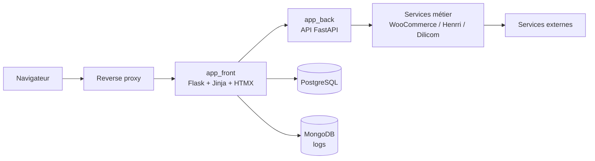

# Application front Sauvetage

[← Retour à la documentation du projet](../README.md)

Le dossier `app_front` contient l'interface web de Sauvetage. Il s'agit d'une application Flask rendue côté serveur, destinée à l'utilisation interne de la plateforme de gestion.

Ce README décrit le périmètre fonctionnel, les technologies et l'architecture de l'application front. Les procédures globales de démarrage, d'orchestration des conteneurs et de déploiement sont documentées au niveau du projet racine.

## Fonctionnalités

### Authentification et contrôle d'accès

- connexion et déconnexion des utilisateurs ;
- validation de session auprès de l'application backend ;
- contrôle des permissions avant l'accès aux routes protégées ;
- protection CSRF des requêtes qui modifient les données ;
- sessions Flask configurées avec cookies `HttpOnly`, `SameSite=Lax` et `Secure` hors mode debug ;
- gestion des utilisateurs et des mots de passe depuis l'administration.

### Pilotage et données métier

- dashboard avec indicateurs de commandes, stocks, finances et activité ;
- gestion des clients, adresses, téléphones et emails ;
- gestion des fournisseurs et de leurs objets ;
- gestion des objets, livres, médias, tags et variations ;
- recherche et autocomplétion des objets et fournisseurs ;
- gestion de l'inventaire, des stocks, des réservations, des retours et des mouvements associés ;
- gestion des commandes clients et fournisseurs, de leurs lignes, adresses, factures et expéditions ;
- consultation et génération de documents métier, notamment les bons de commande et les factures.

### Administration et intégrations

- administration des utilisateurs, des taux de TVA et des logs ;
- consultation détaillée des événements enregistrés dans MongoDB ;
- interface de suivi de l'intégration WooCommerce ;
- préparation et consultation des données liées à Henrri et Dilicom via les services partagés ;
- journalisation des actions utilisateur et des événements métier avec métadonnées de requête.

## Technologies

### Backend web

- **Python 3.10+** ;
- **Flask 3.1** pour l'application web et le routage ;
- **Jinja2** pour le rendu des pages HTML ;
- **Flask-WTF** et **CSRFProtect** pour les formulaires et la protection CSRF ;
- **Gunicorn** comme serveur WSGI en environnement d'exécution ;
- **Werkzeug ProxyFix** pour prendre en compte les informations transmises par le reverse proxy.

### Interactions et présentation

- **HTMX** pour les mises à jour partielles et les interactions sans rechargement complet ;
- JavaScript pour les interactions spécifiques, notamment le dashboard et les composants utilisateur ;
- CSS et SCSS organisés par domaine fonctionnel ;
- fichiers TOML pour associer à chaque page son layout, ses feuilles de style et ses scripts.

### Données et services

- **SQLAlchemy 2** pour l'accès à la base applicative PostgreSQL ;
- **scoped_session** pour gérer la session SQLAlchemy dans le contexte d'une requête Flask ;
- **MongoDB** pour la centralisation des logs ;
- **Requests** pour les échanges avec l'application backend ;
- clients et bibliothèques dédiés aux intégrations WooCommerce, Henrri et Dilicom ;
- **Pillow**, **qrcode** et **python-magic** pour les traitements de fichiers et de médias utilisés par l'interface.

## Architecture

```text
app_front/
├── main.py                 # Création et configuration de l'application Flask
├── blueprints/             # Fonctionnalités regroupées par domaine métier
│   ├── admin/              # Administration, utilisateurs, TVA et logs
│   ├── customer/           # Clients et données associées
│   ├── dashboard/          # Pages et données du tableau de bord
│   ├── inventory/          # Inventaire
│   ├── order/              # Commandes clients et fournisseurs
│   ├── stock/              # Stocks, recherches, réservations et retours
│   ├── supplier/           # Fournisseurs
│   ├── user/               # Authentification et compte utilisateur
│   └── woocommerce/        # Interface de synchronisation WooCommerce
├── config/                 # Configuration Flask, base de données et pages
├── static/                 # CSS, JavaScript et images
├── templates/              # Templates Jinja et fragments HTMX
└── utils/                  # Rendu des pages, documents, routage et métadonnées
```

### Application Flask

`main.py` crée l'instance Flask et configure les éléments transverses :

1. chargement de la configuration et de la clé secrète ;
2. activation de la protection CSRF ;
3. enregistrement des blueprints ;
4. application de `ProxyFix` ;
5. validation de la session avant chaque requête protégée ;
6. commit ou rollback de la session SQLAlchemy à la fin de la requête ;
7. journalisation de la requête et de ses métadonnées.

### Blueprints par domaine

Chaque domaine est isolé dans un blueprint. Cette organisation limite la taille des modules et sépare les responsabilités :

- `routes.py` contient les pages HTML et les routes principales ;
- `routes_data.py` expose les réponses de données utilisées par le dashboard ou JavaScript ;
- `routes_htmx*.py` expose les fragments HTML et les actions HTMX ;
- `forms.py` contient les formulaires WTForms ;
- `utils.py` contient la logique applicative propre au domaine.

Les blueprints ne construisent pas directement les requêtes SQL métier. Ils utilisent les utilitaires front et les repositories/services du package partagé `db_models`.

### Rendu des pages

Le rendu passe par `app_front/utils/pages.py`. La fonction `render_page()` charge la configuration TOML de la page, sélectionne le layout Jinja principal et lui transmet le contexte nécessaire.

Cette configuration permet notamment de déclarer les ressources CSS et JavaScript nécessaires à une page sans modifier le code de la route.

### Flux avec les autres composants



- le navigateur reçoit les pages Jinja et les fragments HTMX ;
- le frontend valide les sessions auprès de `app_back` pour les routes protégées ;
- les repositories et services partagés donnent accès aux données et aux intégrations ;
- les événements et actions sont transmis au système de logs MongoDB ;
- les appels aux services externes sont principalement orchestrés par les couches backend et services métier.

## Organisation des ressources

- `templates/` contient les layouts, pages complètes, pages d'erreur et fragments HTMX ;
- `static/css/` contient les styles communs et les styles spécifiques aux domaines ;
- `static/js/` contient les scripts communs et les scripts du dashboard, de l'inventaire et de l'authentification ;
- `config/pages/` contient la configuration TOML des pages et de leurs ressources ;
- `config/company.toml` contient la configuration visuelle et métier propre à l'entreprise.

## Tests

Les tests du frontend sont regroupés dans `tests/front/`. Ils couvrent notamment :

- l'accès aux pages et les codes HTTP ;
- les permissions par profil utilisateur ;
- les routes des blueprints ;
- les interactions avec les formulaires et les services simulés.

Les rapports de tests et de couverture sont centralisés dans `tests/reports/`, au niveau du projet global.
