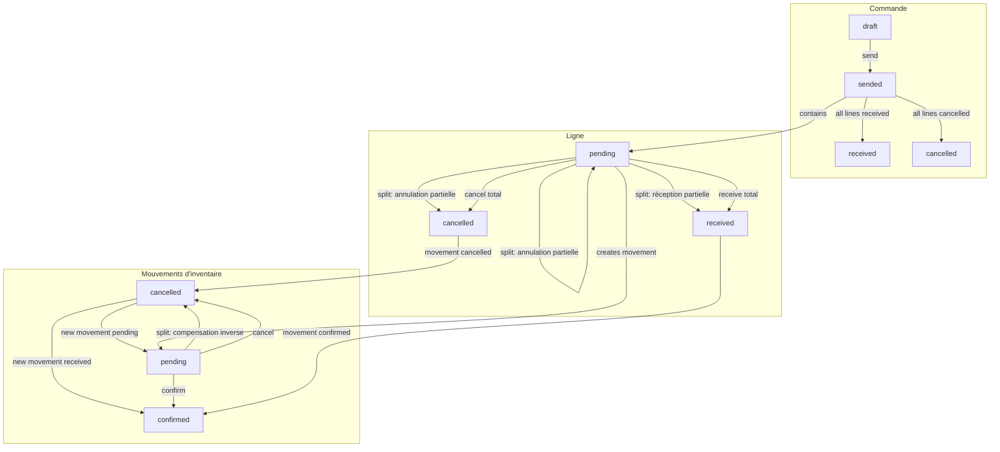

# Workflow complet commandes fournisseurs

```mermaid
flowchart TD

%% ============================
%% COMMAND STATES
%% ============================

subgraph COMMANDE["Commande"]
    C_DRAFT["draft"]
    C_SENDED["sended"]
    C_RECEIVED["received"]
    C_CANCELLED["cancelled"]
end

C_DRAFT -->|send| C_SENDED
C_SENDED -->|all lines received| C_RECEIVED
C_SENDED -->|all lines cancelled| C_CANCELLED


%% ============================
%% LINE STATES
%% ============================

subgraph LIGNE["Ligne"]
    L_PENDING["pending"]
    L_RECEIVED["received"]
    L_CANCELLED["cancelled"]

    %% Split operations
    L_PENDING -->|split: réception partielle| L_RECEIVED
    L_PENDING -->|split: réception partielle| L_PENDING

    L_PENDING -->|split: annulation partielle| L_CANCELLED
    L_PENDING -->|split: annulation partielle| L_PENDING
end

%% Normal transitions
L_PENDING -->|receive total| L_RECEIVED
L_PENDING -->|cancel total| L_CANCELLED


%% ============================
%% INVENTORY MOVEMENTS
%% ============================

subgraph MOUVEMENTS["Mouvements d'inventaire"]
    M_PENDING["pending"]
    M_CONFIRMED["confirmed"]
    M_CANCELLED["cancelled"]

    %% Split logic
    M_PENDING -->|split: compensation inverse| M_CANCELLED
    M_CANCELLED -->|new movement received| M_CONFIRMED
    M_CANCELLED -->|new movement pending| M_PENDING
end

%% Normal transitions
M_PENDING -->|confirm| M_CONFIRMED
M_PENDING -->|cancel| M_CANCELLED


%% ============================
%% RELATIONS
%% ============================

%% Commande → Lignes
C_SENDED -->|contains| L_PENDING

%% Lignes → Mouvements
L_PENDING -->|creates movement| M_PENDING
L_RECEIVED -->|movement confirmed| M_CONFIRMED
L_CANCELLED -->|movement cancelled| M_CANCELLED

```
