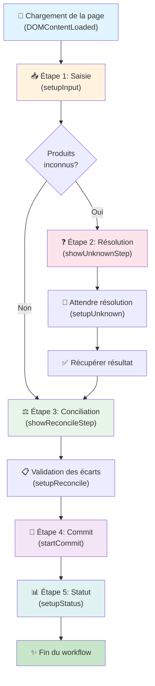

# Module Inventaire - Frontend

## Description

Ce module gère le workflow complet de gestion d'inventaire côté frontend, orchestrant les étapes du processus de saisie, validation et validation des données d'inventaire.

## Architecture du Workflow

Le module `inventory.js` orchestre le flux suivant :

## Étapes du Workflow

### 1️⃣ **Saisie (Input)**

- **Fonction**: `setupInput(callback)`
- **Localisation**: `input.js`
- **Rôle**: Configure les éléments de saisie et lance le parsing des données
- **Sortie**: Résultat du parsing (articles, inconnus EAN13)

### 2️⃣ **Résolution des Inconnus** (Conditionnel)

- **Condition**: Exécuté seulement si `parseResult.unknown.length > 0`
- **Fonctions**:
  - `setupUnknown(callback)` - Configure les listeners
  - `showUnknownStep(unknowns)` - Affiche l'interface de résolution
- **Localisation**: `unknown.js`
- **Rôle**: Permet à l'utilisateur de résoudre les produits non reconnus

### 3️⃣ **Conciliation (Reconcile)**

- **Fonction**: `setupReconcile(callback)` et `showReconcileStep(ean13)`
- **Localisation**: `reconcile.js`
- **Rôle**: Valide les écarts entre les données attendues et réelles
- **Sortie**: Données planifiées validées

### 4️⃣ **Commit et Statut**

- **Fonctions**:
  - `startCommit(planned)` - Lance la validation finale
  - `setupStatus()` - Affiche le statut
- **Localisation**: `status.js`
- **Rôle**: Finalise l'inventaire et affiche le résultat

## Fichiers du Module

| Fichier | Responsabilité |
| ------- | --------------- |
| `inventory.js` | **Orchestration principale** - gère le flux global |
| `input.js` | Gestion de la saisie et parsing des données |
| `unknown.js` | Résolution des produits inconnus |
| `reconcile.js` | Validation des écarts |
| `status.js` | Statut final et commit |
| `api.js` | Appels API backend |
| `functions.js` | Fonctions utilitaires |

## Communication Entre Étapes

Les étapes communiquent via :

- **Callbacks**: Chaque étape déclenche un callback lorsqu'elle est terminée
- **État global**: Accès aux résultats via `getParseResult()`
- **Événements DOM**: Listeners sur les éléments d'interface

## Points Clés

- ✅ **Flux conditionnel**: L'étape de résolution des inconnus est optionnelle
- ✅ **Séquence stricte**: Respecte l'ordre des étapes pour garantir la cohérence
- ✅ **Modularité**: Chaque étape est isolée dans son propre fichier
- ✅ **Événements asynchrones**: Utilise les callbacks pour gérer l'asynchrone
