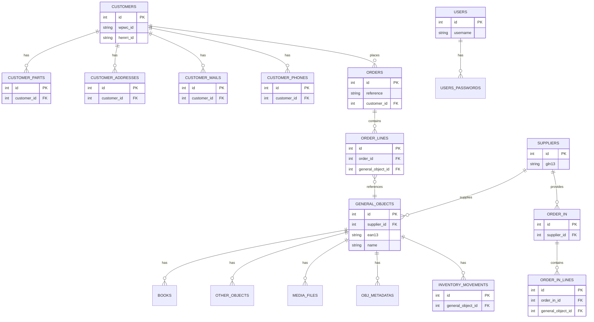

# Schéma des tables - db_models

Ce document présente un résumé des modèles SQLAlchemy définis dans `db_models/objects`.

Chaque section liste la table, ses colonnes principales, types et relations.

---

## Tables liées aux clients (customers)

- **customers** (schema: `app_schema`)
  - id: Integer PK
  - wpwc_id: String(50), unique, nullable
  - henrri_id: String(100), unique, nullable
  - customer_type: String(20), default `part`
  - is_active: Boolean
  - created_at, updated_at, last_synced_at: DateTime
  - Relations: `part` (customer_parts), `pro` (customer_pros), `addresses`, `emails`, `phones`, `sync_logs`, `orders`

- **customer_parts**
  - id: Integer PK
  - customer_id: FK -> app_schema.customers.id (unique)
  - civil_title, first_name, last_name, date_of_birth

- **customer_pros**
  - id: Integer PK
  - customer_id: FK -> app_schema.customers.id (unique)
  - company_name, siret_number (unique), vat_number (unique)

- **customer_addresses**
  - id: Integer PK
  - customer_id: FK -> app_schema.customers.id
  - address_name, address_line1, address_line2, city, state, postal_code, country
  - is_billing, is_shipping, is_active, created_at, updated_at

- **customer_mails**
  - id: Integer PK
  - customer_id: FK -> app_schema.customers.id
  - email_name, email (unique), is_active, created_at, updated_at

- **customer_phones**
  - id: Integer PK
  - customer_id: FK -> app_schema.customers.id
  - phone_name, phone_number (unique), is_active, created_at, updated_at

- **customer_sync_logs**
  - id: Integer PK
  - customer_id: FK -> app_schema.customers.id
  - sync_source, sync_direction, sync_status, external_id, external_system
  - fields_synced, error_message, synced_at, created_at

---

## Commandes et lignes de commandes (orders)

- **orders**
  - id: Integer PK
  - reference: String(14) unique
  - customer_id: FK -> app_schema.customers.id
  - invoice_address_id, delivery_address_id: FK -> app_schema.customer_addresses.id
  - status, create_source, created_at, update_source, updated_at, last_synced_at
  - Relations: `order_lines`

- **order_lines**
  - id: Integer PK
  - order_id: FK -> app_schema.orders.id
  - invoice_id: FK -> app_schema.invoices.id (nullable)
  - shipment_id: FK -> app_schema.shipments.id (nullable)
  - general_object_id: FK -> app_schema.general_objects.id
  - quantity: Integer
  - unit_price: Numeric(10,2)
  - vat_rate: Numeric(10,3)
  - create_source, created_at, update_source, updated_at

Note: suppression interdite si `invoice_id` non null (événement `before_delete`).

---

## Stocks et entrées (stocks)

- **order_in**
  - id: Integer PK
  - order_ref: String
  - external_ref: Integer (nullable)
  - supplier_id: FK -> app_schema.suppliers.id
  - value: Numeric(10,2)
  - order_state: String (default `draft`)
  - Relations: `orderin_lines`, `supplier`

- **order_in_lines**
  - id: Integer PK
  - order_in_id: FK -> app_schema.order_in.id
  - general_object_id: FK -> app_schema.general_objects.id
  - inventory_movement_id: FK -> app_schema.inventory_movements.id (nullable)
  - qty_ordered, qty_received: Integer
  - unit_price: Numeric(10,2)
  - vat_rate: Numeric(10,3)
  - line_state: String (default `pending`)

- **dilicom_referential**
  - id: Integer PK
  - ean13: FK -> app_schema.general_objects.ean13
  - gln13: FK -> app_schema.suppliers.gln13
  - create_ref, delete_ref, is_active, dilicom_synced: Boolean
  - created_at, updated_at: String ISO timestamps

---

## Inventaire

- **inventory_movements**
  - id: Integer PK
  - general_object_id: FK -> app_schema.general_objects.id
  - movement_type: String (in/out/reserved/inventory)
  - quantity: Integer
  - movement_timestamp: DateTime
  - price_at_movement: Float
  - source, destination, notes: String

---

## Factures (invoices)

- **invoices**
  - id: Integer PK
  - reference: String(14) unique
  - total_amount: Numeric(10,2)
  - vat_amount: Numeric(10,2)
  - create_source, created_at, update_source, updated_at, last_synced_at
  - Relations: `order_lines`

Note: suppression interdite (événement `before_delete`).

---

## Envois (shipments)

- **shipments**
  - id: Integer PK
  - reference: String(14) unique
  - carrier, tracking_number
  - create_source, created_at, update_source, updated_at, last_synced_at
  - Relations: `order_lines`

---

## Fournisseurs (suppliers)

- **suppliers**
  - id: Integer PK
  - name, gln13 (unique), contact_email, contact_phone
  - is_active, created_at, updated_at
  - Relations: `objects` (general_objects), `orderin`, `dilicom_referencial`

---

## Objets généraux et métadonnées (objects)

- **general_objects**
  - id: Integer PK
  - supplier_id: FK -> app_schema.suppliers.id
  - general_object_type, ean13 (unique), name, description
  - price: Numeric(10,2)
  - created_at, updated_at, last_inventory_timestamp, is_active
  - Relations: `book`, `other_object`, `inventory_movements`, `obj_metadatas`, `object_tags`, `media_files`, `order_lines`, `orderin_lines`, `dilicom_referencial`

- **books**
  - id: Integer PK
  - general_object_id: FK -> app_schema.general_objects.id
  - author, diffuser, editor, genre, publication_year, pages, created_at, updated_at

- **other_objects**
  - id: Integer PK
  - general_object_id: FK -> app_schema.general_objects.id
  - created_at, updated_at

- **tags**
  - id: Integer PK
  - name (unique), description, created_at, updated_at

- **object_tags**
  - id: Integer PK
  - general_object_id: FK -> app_schema.general_objects.id
  - tag_id: FK -> app_schema.tags.id

- **obj_metadatas**
  - id: Integer PK
  - general_object_id: FK -> app_schema.general_objects.id
  - semistructured_data: JSON
  - created_at, updated_at

- **media_files**
  - id: Integer PK
  - general_object_id: FK -> app_schema.general_objects.id
  - file_name, file_type, alt_text, file_data (LargeBinary), file_link
  - uploaded_at, is_principal

---

## Utilisateurs (auth)

- **users** (schema: `auth_schema`)
  - id: Integer PK
  - username: String unique
  - email: String unique
  - is_active, nb_failed_logins, is_locked, permissions (string)
  - created_at, updated_at
  - Relations: `passwords` (UsersPasswords)

- **users_passwords** (schema: `auth_schema`)
  - id: Integer PK
  - user_id: FK -> auth_schema.users.id (ondelete=CASCADE)
  - password_hash, from_date, to_date, created_at, updated_at

---

## Remarques

- Les tables utilisent principalement les schémas `app_schema` (données métier) et `auth_schema` (authentification).
- Les contraintes d'intégrité importantes sont exprimées via les clés étrangères et les événements SQLAlchemy (`before_delete`) pour empêcher certaines suppressions.
- Pour le modèle complet et le code source, voir les fichiers de `db_models/objects`.

## Diagramme ER (Mermaid)

Voici un diagramme Mermaid simplifié représentant les principales tables et relations :

Ce diagramme est simplifié — il ne montre pas toutes les colonnes ni toutes les relations secondaires. Si tu veux, je peux générer une version plus détaillée (avec plus de colonnes), ou une version exportable au format PNG/SVG.
