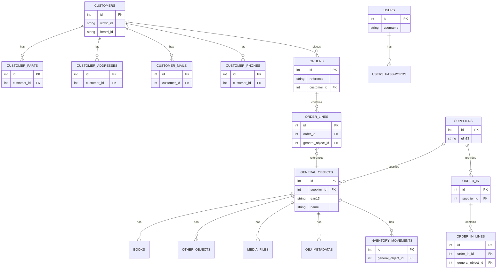

# Schéma des tables - db_models

Ce document présente un résumé des modèles SQLAlchemy définis dans `db_models/objects`.

Chaque section liste la table, ses colonnes principales, types et relations.

## Quota Henrri

`HENRRI_RATE_LIMITING=20` dans `config/env/.env.henrri` limite les appels Henrri à
20 requêtes sur une fenêtre glissante de 60 secondes. Utiliser `HENRRI_RATE_LIMITING=60`
en production si ce quota est autorisé. La valeur doit être un entier strictement positif.

Le front et le back chargent le même fichier et partagent un compteur MongoDB dans
`MONGO_DB_LOGS`, avec les collections dédiées `henrri_rate_limit_windows` et
`henrri_rate_limit_counters`. Le quota inclut les appels d'authentification et les
requêtes en échec : il compte les requêtes HTTP, pas les articles. Une fois le quota
atteint, l'appel attend un créneau. Si le compteur MongoDB est indisponible, l'envoi
est bloqué explicitement ; les créations ne sont pas relancées automatiquement.

Après une modification du quota, recréer ensemble les conteneurs front et back
pour qu'ils utilisent la même valeur. Les horloges des hôtes doivent être synchronisées.

### Crédits Mensuels

La synchronisation partenaires des **produits**, unitaire ou globale, ne cible
plus Henrri. Les produits restent synchronisés lors de la facturation. Les clients
partenaires restent synchronisés et leurs écritures partagent le budget mensuel.

Le même fichier d'environnement configure ce budget :

```dotenv
HENRRI_CREDIT_LIMIT=200
HENRRI_MONTHLY_CREDIT_INITIAL_PERIOD=2026-10
HENRRI_MONTHLY_CREDIT_INITIAL_USED=0
```

Le plafond provient de `HENRRI_CREDIT_LIMIT`, qui doit être un entier strictement positif
(200 par défaut si la variable est absente). La collection MongoDB
`henrri_monthly_credits` contient un document par compte, environnement et mois UTC.
La consommation historique ne s'applique qu'à la création du document du mois
indiqué : modifier l'environnement ne réinitialise jamais un compteur existant.
Un nouveau budget commence automatiquement le premier du mois à 00:00 UTC, sans cron.

Chaque écriture métier (`POST`, `PUT`, `PATCH`, `DELETE`) réserve atomiquement un
crédit avant l'envoi. Une réponse HTTP 2xx confirme sa consommation, une réponse
en erreur ou un échec certain de connexion libère la réservation. L'authentification,
le renouvellement du jeton et les lectures ne consomment aucun crédit mensuel,
mais restent limités par `HENRRI_RATE_LIMITING`.

Un timeout de réception ou d'écriture peut cacher un succès distant : sa réservation
reste alors indisponible jusqu'à vérification. Si MongoDB échoue après une réponse
réussie, la réservation est conservée sans masquer l'identifiant renvoyé par Henrri.
Les journaux indiquent le document mensuel et le jeton concernés. Ne pas relancer
aveuglément une création distante dont l'issue est inconnue.

Le contrôle préalable bloque une nouvelle facturation si le budget est épuisé ou
invérifiable, avant la création locale. Chaque écriture reste contrôlée : une facture
peut donc s'interrompre en cours de synchronisation. Dans ce cas, la facture locale,
ses identifiants distants confirmés et son journal d'échec sont conservés pour une
reprise ultérieure. Le téléchargement des PDF et les lectures restent possibles
lorsque le budget mensuel est épuisé.

Pour vérifier le compteur, utiliser `get_monthly_credits(api_key, base_url).get_status()`
depuis un environnement configuré pour le compte concerné, sans afficher les clés.
L'état expose `consumed`, `available` et `reservations`. Après vérification **chez
Henrri** de l'issue d'une réservation, utiliser `confirm(reservation)` si l'écriture
a réussi, ou `cancel(reservation)` si elle a certainement échoué. Une réservation
est identifiée par `CreditReservation(document_id, token)`. Ces opérations sont
idempotentes et portent sur le mois d'origine ; ne jamais les appliquer à une
requête encore en cours ou à un résultat toujours inconnu.

Ce compteur ne voit pas les écritures effectuées par d'autres applications : la
consommation initiale doit les inclure. Tous les travailleurs doivent charger les
mêmes paramètres et identifiants de compte. Les tests unitaires n'appellent pas
Henrri ; le test concurrent MongoDB peut être activé avec `HENRRI_TEST_MONGO_URI`
pointant vers une base **de test uniquement**.

---

## Tables liées aux clients (customers)

- **customers** (schema: `app_schema`)
  - id: Integer PK
  - wpwc_id: String(50), unique, nullable
  - henrri_id: String(100), unique, nullable
  - customer_type: String(20), default `part`
  - is_active: Boolean
  - created_at, updated_at, last_synced_at: DateTime
  - Relations: `part` (customer_parts), `pro` (customer_pros), `addresses`, `emails`, `phones`, `sync_logs`, `orders`

- **customer_parts**
  - id: Integer PK
  - customer_id: FK -> app_schema.customers.id (unique)
  - civil_title, first_name, last_name, date_of_birth

- **customer_pros**
  - id: Integer PK
  - customer_id: FK -> app_schema.customers.id (unique)
  - company_name, siret_number (unique), vat_number (unique)

- **customer_addresses**
  - id: Integer PK
  - customer_id: FK -> app_schema.customers.id
  - address_name, address_line1, address_line2, city, state, postal_code, country
  - is_billing, is_shipping, is_active, created_at, updated_at

- **customer_mails**
  - id: Integer PK
  - customer_id: FK -> app_schema.customers.id
  - email_name, email (unique), is_active, created_at, updated_at

- **customer_phones**
  - id: Integer PK
  - customer_id: FK -> app_schema.customers.id
  - phone_name, phone_number (unique), is_active, created_at, updated_at

- **customer_sync_logs**
  - id: Integer PK
  - customer_id: FK -> app_schema.customers.id
  - sync_source, sync_direction, sync_status, external_id, external_system
  - fields_synced, error_message, synced_at, created_at

---

## Commandes et lignes de commandes (orders)

- **orders**
  - id: Integer PK
  - reference: String(14) unique
  - customer_id: FK -> app_schema.customers.id
  - invoice_address_id, delivery_address_id: FK -> app_schema.customer_addresses.id
  - status, create_source, created_at, update_source, updated_at, last_synced_at
  - Relations: `order_lines`

- **order_lines**
  - id: Integer PK
  - order_id: FK -> app_schema.orders.id
  - invoice_id: FK -> app_schema.invoices.id (nullable)
  - shipment_id: FK -> app_schema.shipments.id (nullable)
  - general_object_id: FK -> app_schema.general_objects.id
  - quantity: Integer
  - unit_price: Numeric(10,2)
  - vat_rate: Numeric(10,3)
  - create_source, created_at, update_source, updated_at

Note: suppression interdite si `invoice_id` non null (événement `before_delete`).

---

## Stocks et entrées (stocks)

- **order_in**
  - id: Integer PK
  - order_ref: String
  - external_ref: Integer (nullable)
  - supplier_id: FK -> app_schema.suppliers.id
  - value: Numeric(10,2)
  - order_state: String (default `draft`)
  - Relations: `orderin_lines`, `supplier`

- **order_in_lines**
  - id: Integer PK
  - order_in_id: FK -> app_schema.order_in.id
  - general_object_id: FK -> app_schema.general_objects.id
  - inventory_movement_id: FK -> app_schema.inventory_movements.id (nullable)
  - qty_ordered, qty_received: Integer
  - unit_price: Numeric(10,2)
  - vat_rate: Numeric(10,3)
  - line_state: String (default `pending`)

- **dilicom_referential**
  - id: Integer PK
  - ean13: FK -> app_schema.general_objects.ean13
  - gln13: FK -> app_schema.suppliers.gln13
  - create_ref, delete_ref, is_active, dilicom_synced: Boolean
  - created_at, updated_at: String ISO timestamps

---

## Inventaire

- **inventory_movements**
  - id: Integer PK
  - general_object_id: FK -> app_schema.general_objects.id
  - movement_type: String (in/out/reserved/inventory)
  - quantity: Integer
  - movement_timestamp: DateTime
  - price_at_movement: Float
  - source, destination, notes: String

---

## Factures (invoices)

- **invoices**
  - id: Integer PK
  - reference: String(14) unique
  - total_amount: Numeric(10,2)
  - vat_amount: Numeric(10,2)
  - create_source, created_at, update_source, updated_at, last_synced_at
  - Relations: `order_lines`

Note: suppression interdite (événement `before_delete`).

---

## Envois (shipments)

- **shipments**
  - id: Integer PK
  - reference: String(14) unique
  - carrier, tracking_number
  - create_source, created_at, update_source, updated_at, last_synced_at
  - Relations: `order_lines`

---

## Fournisseurs (suppliers)

- **suppliers**
  - id: Integer PK
  - name, gln13 (unique), contact_email, contact_phone
  - is_active, created_at, updated_at
  - Relations: `objects` (general_objects), `orderin`, `dilicom_referencial`

---

## Objets généraux et métadonnées (objects)

- **general_objects**
  - id: Integer PK
  - supplier_id: FK -> app_schema.suppliers.id
  - general_object_type, ean13 (unique), name, description
  - price: Numeric(10,2)
  - created_at, updated_at, last_inventory_timestamp, is_active
  - Relations: `book`, `other_object`, `inventory_movements`, `obj_metadatas`, `object_tags`, `media_files`, `order_lines`, `orderin_lines`, `dilicom_referencial`

- **books**
  - id: Integer PK
  - general_object_id: FK -> app_schema.general_objects.id
  - author, diffuser, editor, genre, publication_year, pages, created_at, updated_at

- **other_objects**
  - id: Integer PK
  - general_object_id: FK -> app_schema.general_objects.id
  - created_at, updated_at

- **tags**
  - id: Integer PK
  - name (unique), description, created_at, updated_at

- **object_tags**
  - id: Integer PK
  - general_object_id: FK -> app_schema.general_objects.id
  - tag_id: FK -> app_schema.tags.id

- **obj_metadatas**
  - id: Integer PK
  - general_object_id: FK -> app_schema.general_objects.id
  - semistructured_data: JSON
  - created_at, updated_at

- **media_files**
  - id: Integer PK
  - general_object_id: FK -> app_schema.general_objects.id
  - file_type, alt_text, file_data (LargeBinary), file_link
  - uploaded_at, is_principal

---

## Utilisateurs (auth)

- **users** (schema: `auth_schema`)
  - id: Integer PK
  - username: String unique
  - email: String unique
  - is_active, nb_failed_logins, is_locked, permissions (string)
  - created_at, updated_at
  - Relations: `passwords` (UsersPasswords)

- **users_passwords** (schema: `auth_schema`)
  - id: Integer PK
  - user_id: FK -> auth_schema.users.id (ondelete=CASCADE)
  - password_hash, from_date, to_date, created_at, updated_at

---

## Remarques

- Les tables utilisent principalement les schémas `app_schema` (données métier) et `auth_schema` (authentification).
- Les contraintes d'intégrité importantes sont exprimées via les clés étrangères et les événements SQLAlchemy (`before_delete`) pour empêcher certaines suppressions.
- Pour le modèle complet et le code source, voir les fichiers de `db_models/objects`.

## Diagramme ER (Mermaid)

Voici un diagramme Mermaid simplifié représentant les principales tables et relations :


```mermaid
erDiagram
  CUSTOMERS {
    int id PK
    string wpwc_id
    string henrri_id
  }
  CUSTOMER_PARTS {
    int id PK
    int customer_id FK
  }
  CUSTOMER_ADDRESSES {
    int id PK
    int customer_id FK
  }
  CUSTOMER_MAILS {
    int id PK
    int customer_id FK
  }
  CUSTOMER_PHONES {
    int id PK
    int customer_id FK
  }
  CUSTOMERS ||--o{ CUSTOMER_PARTS : has
  CUSTOMERS ||--o{ CUSTOMER_ADDRESSES : has
  CUSTOMERS ||--o{ CUSTOMER_MAILS : has
  CUSTOMERS ||--o{ CUSTOMER_PHONES : has
  CUSTOMERS ||--o{ ORDERS : places

  ORDERS {
    int id PK
    string reference
    int customer_id FK
  }
  ORDERS ||--o{ ORDER_LINES : contains

  ORDER_LINES {
    int id PK
    int order_id FK
    int general_object_id FK
  }
  ORDER_LINES }o--|| GENERAL_OBJECTS : references

  GENERAL_OBJECTS {
    int id PK
    int supplier_id FK
    string ean13
    string name
  }
  GENERAL_OBJECTS ||--o{ BOOKS : has
  GENERAL_OBJECTS ||--o{ OTHER_OBJECTS : has
  GENERAL_OBJECTS ||--o{ MEDIA_FILES : has
  GENERAL_OBJECTS ||--o{ OBJ_METADATAS : has
  GENERAL_OBJECTS ||--o{ INVENTORY_MOVEMENTS : has

  SUPPLIERS {
    int id PK
    string gln13
  }
  SUPPLIERS ||--o{ GENERAL_OBJECTS : supplies
  SUPPLIERS ||--o{ ORDER_IN : provides

  ORDER_IN {
    int id PK
    int supplier_id FK
  }
  ORDER_IN ||--o{ ORDER_IN_LINES : contains

  ORDER_IN_LINES {
    int id PK
    int order_in_id FK
    int general_object_id FK
  }

  INVENTORY_MOVEMENTS {
    int id PK
    int general_object_id FK
  }

  USERS {
    int id PK
    string username
  }
  USERS ||--o{ USERS_PASSWORDS : has
```

Ce diagramme est simplifié — il ne montre pas toutes les colonnes ni toutes les relations secondaires. Si tu veux, je peux générer une version plus détaillée (avec plus de colonnes), ou une version exportable au format PNG/SVG.
