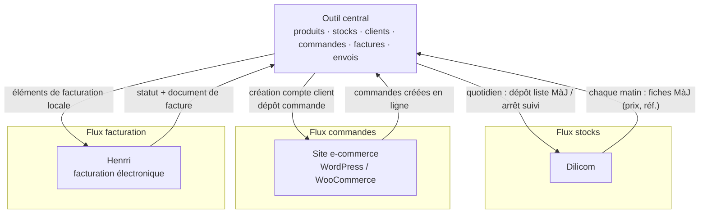

# Flux de travail des données entre les différents systèmes

On a l'outil central, Dilicom, Henrri pour la facturation, le site de e-commerce avec WordPress et WooCommerce.

Dans l'outil central, on crée les produits, les stocks, les clients, les commandes, les factures, les envois.

Une fois par jour je dépose la liste des livres à mettre à jour chez Dilicom ainsi que ceux à ne plus suivre.
Tous les matins, je récupère les fiches de mise à jours (prix, références, etc.)

Quand je crée un client, je crée son compte sur le site Internet depuis l'outil central.
Quand je crée une commande que je dépose sur son compte en ligne ou je récupère les commandes qu'il a créé depuis son compte en ligne.
Je facture en local et j'envoie les éléments au factureur Henrri qui s'occupera de la facturation électronique.
Je trace les éléments concernant l'expédition.
