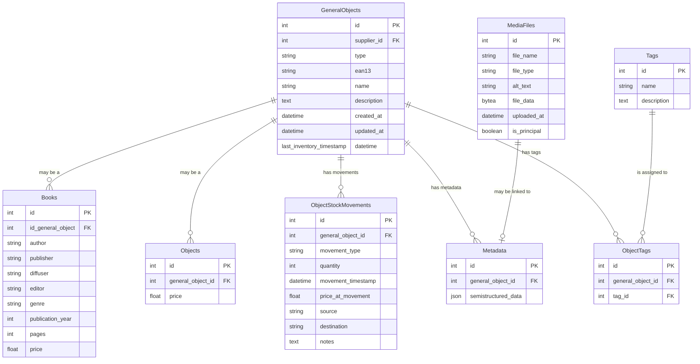

# Gestion des stock de livres



## Description des métadonnées

```json
{
  "language": "string",
  "dimensions": {
    "height": "float",
    "width": "float",
    "depth": "float"
  },
  "weight": "float",
  "edition": "string",
  "awards": ["string"],
  "reviews": [
    {
      "reviewer": "string",
      "rating": "float",
      "comment": "string"
    }
  ],
  "links": [
    "string1",
    "string2"
  ]
}
```
