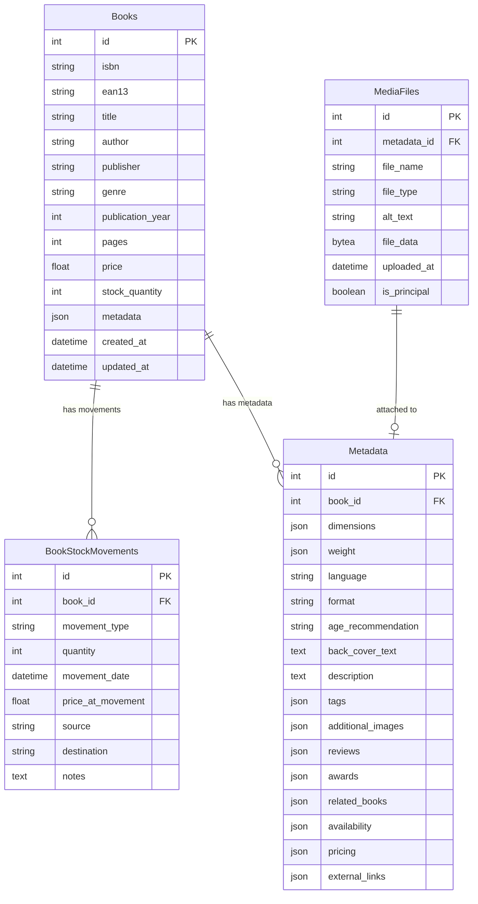

# Gestion des stock de livres

```mermaid
erDiagram
    Books {
        int id PK
        string isbn
        string ean13
        string title
        string author
        string publisher
        string genre
        int publication_year
        int pages
        float price
        int stock_quantity
        json metadata
        datetime created_at
        datetime updated_at
    }
    BookStockMovements {
        int id PK
        int book_id FK
        string movement_type
        int quantity
        datetime movement_date
        float price_at_movement
        string source
        string destination
        text notes
    }
    Metadata {
        int id PK
        int book_id FK
        json dimensions
        json weight
        string language
        string format
        string age_recommendation
        text back_cover_text
        text description
        json tags
        json additional_images
        json reviews
        json awards
        json related_books
        json availability
        json pricing
        json external_links
    }
    MediaFiles {
        int id PK
        int metadata_id FK
        string file_name
        string file_type
        string alt_text
        bytea file_data
        datetime uploaded_at
        boolean is_principal
    }
    %% Relations
    Books ||--o{ BookStockMovements : "has movements"
    Books ||--o{ Metadata : "has metadata"
    MediaFiles ||--o| Metadata : "attached to"
```
