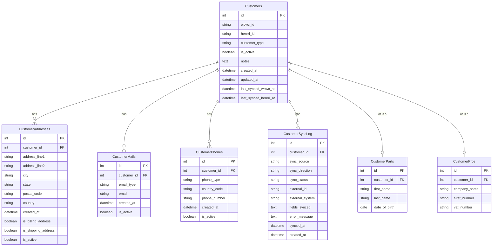

# Gestion des clients

```mermaid
erDiagram
    Customers {
        int id PK
        string wpwc_id
        string henrri_id
        string customer_type
        boolean is_active
        text notes
        datetime created_at
        datetime updated_at
        datetime last_synced_wpwc_at
        datetime last_synced_henrri_at
    }
    CustomerParts {
        int id PK
        int customer_id FK
        string first_name
        string last_name
        date date_of_birth
    }
    CustomerPros {
        int id PK
        int customer_id FK
        string company_name
        string siret_number
        string vat_number
    }
    CustomerAddresses {
        int id PK
        int customer_id FK
        string address_line1
        string address_line2
        string city
        string state
        string postal_code
        string country
        datetime created_at
        boolean is_billing_address
        boolean is_shipping_address
        boolean is_active
    }
    CustomerMails {
        int id PK
        int customer_id FK
        string email_type
        string email
        datetime created_at
        boolean is_active
    }
    CustomerPhones {
        int id PK
        int customer_id FK
        string phone_type
        string country_code
        string phone_number
        datetime created_at
        boolean is_active
    }
    CustomerSyncLog {
        int id PK
        int customer_id FK
        string sync_source
        string sync_direction
        string sync_status
        string external_id
        string external_system
        text fields_synced
        text error_message
        datetime synced_at
        datetime created_at
    }

    %% Relations
    Customers ||--o{ CustomerAddresses : "has"
    Customers ||--o{ CustomerMails : "has"
    Customers ||--o{ CustomerPhones : "has"
    Customers ||--o{ CustomerSyncLog : "has"
    Customers ||--o| CustomerParts : "or is a"
    Customers ||--o| CustomerPros : "or is a"
```
