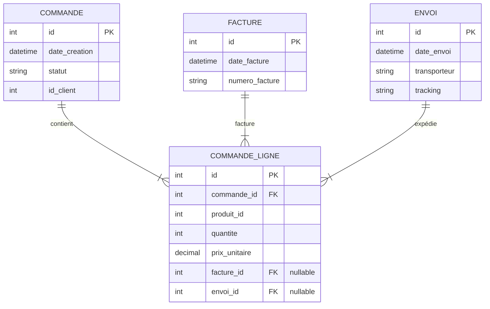

# Gestion des commandes, factures et envois

```mermaid
erDiagram

    COMMANDE {
        int id PK
        datetime date_creation
        string statut
        int id_client
    }

    COMMANDE_LIGNE {
        int id PK
        int commande_id FK
        int produit_id
        int quantite
        decimal prix_unitaire
        int facture_id FK "nullable"
        int envoi_id FK "nullable"
    }

    FACTURE {
        int id PK
        datetime date_facture
        string numero_facture
    }

    ENVOI {
        int id PK
        datetime date_envoi
        string transporteur
        string tracking
    }

    COMMANDE ||--|{ COMMANDE_LIGNE : contient
    FACTURE ||--|{ COMMANDE_LIGNE : "facture"
    ENVOI ||--|{ COMMANDE_LIGNE : "expédie"
```
