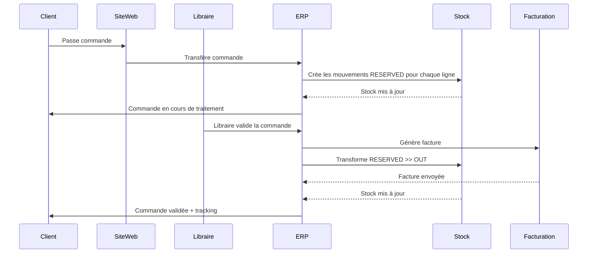
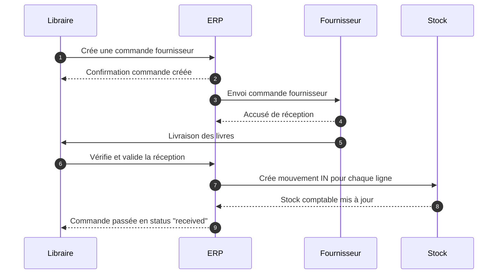

# Gestion des mouvements de stock

## Flux de travail typique pour une commande client

```mermaid
sequenceDiagram
    participant Client
    participant SiteWeb
    participant Libraire
    participant ERP
    participant Stock
    participant Facturation

    Client->>SiteWeb: Passe commande
    SiteWeb->>ERP: Transfère commande
    ERP->>Stock: Crée les mouvements RESERVED pour chaque ligne
    Stock-->>ERP: Stock mis à jour
    ERP->>Client: Commande en cours de traitement

    Libraire->>ERP: Libraire valide la commande
    ERP->>Facturation: Génère facture
    ERP->>Stock: Transforme RESERVED >> OUT
    Facturation-->>ERP: Facture envoyée
    Stock-->>ERP: Stock mis à jour
    ERP->>Client: Commande validée + tracking
```

## Flux de travail typique pour une commande fournisseur

```mermaid
sequenceDiagram
    autonumber

    participant Libraire
    participant ERP
    participant Fournisseur
    participant Stock

    %% --- Création de commande ---
    Libraire->>ERP: Crée une commande fournisseur
    ERP-->>Libraire: Confirmation commande créée
    ERP->>Fournisseur: Envoi commande fournisseur
    Fournisseur-->>ERP: Accusé de réception

    %% --- Livraison ---
    Fournisseur->>Libraire: Livraison des livres
    Libraire->>ERP: Vérifie et valide la réception
    ERP->>Stock: Crée mouvement IN pour chaque ligne
    Stock-->>ERP: Stock comptable mis à jour
    ERP-->>Libraire: Commande passée en status "received"
```
