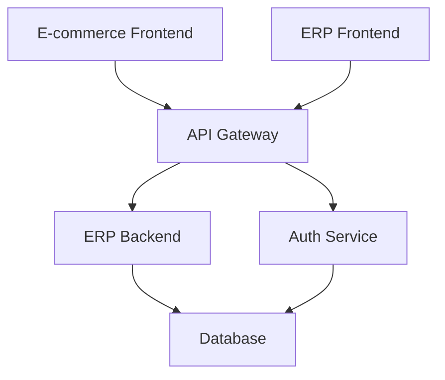

# Sous-Projets - Sauvetage

Ce répertoire centralise les informations et liens vers les différents sous-projets qui composent le système Sauvetage.

## Architecture en Sous-Projets

Le projet Sauvetage est organisé en plusieurs sous-projets indépendants mais interconnectés :

```
sauvetage (ce dépôt)
│
├── sauvetage-erp-backend        # Backend ERP
├── sauvetage-ecommerce-frontend # Frontend E-commerce
├── sauvetage-erp-frontend       # Frontend ERP (Admin)
├── sauvetage-api-gateway        # API Gateway
├── sauvetage-auth-service       # Service d'authentification
└── sauvetage-database           # Schémas et migrations
```

## Liste des Sous-Projets

### 1. Backend ERP
**Nom** : `sauvetage-erp-backend`  
**Description** : API backend pour la gestion interne (ERP)  
**Technologies** : Node.js, Express, TypeScript, PostgreSQL, Prisma  
**Dépôt** : [github.com/remiv1/sauvetage-erp-backend](https://github.com/remiv1/sauvetage-erp-backend) *(à créer)*  
**Documentation** : [Lien vers la doc](./sauvetage-erp-backend.md)

**Responsabilités** :
- Gestion des stocks
- Gestion des commandes internes
- Gestion des fournisseurs
- Rapports et analytics

### 2. Frontend E-commerce
**Nom** : `sauvetage-ecommerce-frontend`  
**Description** : Interface client pour les achats en ligne  
**Technologies** : React, TypeScript, TailwindCSS, Next.js  
**Dépôt** : [github.com/remiv1/sauvetage-ecommerce-frontend](https://github.com/remiv1/sauvetage-ecommerce-frontend) *(à créer)*  
**Documentation** : [Lien vers la doc](./sauvetage-ecommerce-frontend.md)

**Responsabilités** :
- Catalogue de produits
- Panier et checkout
- Compte client
- Suivi de commandes

### 3. Frontend ERP (Admin)
**Nom** : `sauvetage-erp-frontend`  
**Description** : Interface d'administration pour le personnel  
**Technologies** : React, TypeScript, Ant Design  
**Dépôt** : [github.com/remiv1/sauvetage-erp-frontend](https://github.com/remiv1/sauvetage-erp-frontend) *(à créer)*  
**Documentation** : [Lien vers la doc](./sauvetage-erp-frontend.md)

**Responsabilités** :
- Dashboard admin
- Gestion des produits
- Gestion des stocks
- Gestion des commandes
- Rapports

### 4. API Gateway
**Nom** : `sauvetage-api-gateway`  
**Description** : Point d'entrée unique pour tous les services  
**Technologies** : Node.js, Express, TypeScript  
**Dépôt** : [github.com/remiv1/sauvetage-api-gateway](https://github.com/remiv1/sauvetage-api-gateway) *(à créer)*  
**Documentation** : [Lien vers la doc](./sauvetage-api-gateway.md)

**Responsabilités** :
- Routage des requêtes
- Load balancing
- Rate limiting
- Logging centralisé
- Authentication/Authorization

### 5. Service d'Authentification
**Nom** : `sauvetage-auth-service`  
**Description** : Service dédié à l'authentification et autorisation  
**Technologies** : Node.js, Express, TypeScript, JWT, Redis  
**Dépôt** : [github.com/remiv1/sauvetage-auth-service](https://github.com/remiv1/sauvetage-auth-service) *(à créer)*  
**Documentation** : [Lien vers la doc](./sauvetage-auth-service.md)

**Responsabilités** :
- Authentification utilisateurs
- Gestion des sessions
- Gestion des rôles et permissions
- OAuth intégrations

### 6. Base de Données
**Nom** : `sauvetage-database`  
**Description** : Schémas, migrations et seeds  
**Technologies** : PostgreSQL, Prisma  
**Dépôt** : [github.com/remiv1/sauvetage-database](https://github.com/remiv1/sauvetage-database) *(à créer)*  
**Documentation** : [Lien vers la doc](./sauvetage-database.md)

**Responsabilités** :
- Schémas de base de données
- Migrations versionnées
- Seeds de données de test
- Documentation du modèle de données

## Organisation des Sous-Projets

### Structure Type
Chaque sous-projet suit une structure similaire :

```
sous-projet/
├── src/               # Code source
├── tests/             # Tests
├── docs/              # Documentation spécifique
├── .github/           # Workflows CI/CD
├── package.json       # Dépendances (Node.js)
├── README.md          # Documentation principale
└── LICENSE            # Licence (Apache 2.0)
```

### Standards Communs

#### Git
- Même workflow Git que le dépôt principal
- Convention de commits identique
- Revue de code obligatoire

#### CI/CD
- Tests automatisés sur chaque PR
- Linting et formatage
- Build automatique
- Déploiement automatisé (staging)

#### Documentation
- README complet dans chaque sous-projet
- Documentation API (Swagger/OpenAPI)
- Exemples d'utilisation
- Changelog

## Dépendances entre Sous-Projets



## Démarrage Local

### Prérequis
- Node.js 20+
- PostgreSQL 15+
- Redis 7+
- Docker & Docker Compose

### Quick Start
```bash
# Cloner tous les sous-projets
git clone https://github.com/remiv1/sauvetage-erp-backend.git
git clone https://github.com/remiv1/sauvetage-ecommerce-frontend.git
# ... autres sous-projets

# Ou utiliser le script de setup (à créer)
./scripts/setup-dev.sh

# Démarrer tous les services avec Docker Compose
docker-compose up -d
```

## Contribution

### Workflow
1. Créer une branche dans le sous-projet concerné
2. Développer et tester localement
3. Créer une PR avec description détaillée
4. Attendre la revue de code
5. Merger après approbation

### Communication
- Issues dans le sous-projet concerné pour les bugs/features spécifiques
- Issues dans le dépôt principal pour les sujets transverses
- Discussions GitHub pour les questions générales

## Versionnement

### Stratégie
- **Semantic Versioning** : MAJOR.MINOR.PATCH
- Releases coordonnées entre sous-projets
- Tags Git pour chaque version

### Compatibility Matrix
| Version Principale | ERP Backend | E-commerce Frontend | API Gateway |
|-------------------|-------------|---------------------|-------------|
| v1.0.0            | v1.0.0      | v1.0.0             | v1.0.0      |
| v1.1.0            | v1.1.0      | v1.0.1             | v1.0.0      |

## Déploiement

### Environnements
Chaque sous-projet est déployé dans les mêmes environnements :
- **Development** : Local
- **Staging** : Pré-production
- **Production** : Production

### Pipeline
1. Commit sur branche feature
2. Tests automatiques
3. Merge dans develop
4. Déploiement auto sur staging
5. Tests de validation
6. Merge dans main
7. Déploiement manuel sur production

## Monitoring

### Métriques Globales
Dashboard centralisé montrant la santé de tous les sous-projets :
- Status des services
- Temps de réponse
- Taux d'erreur
- Utilisation des ressources

### Alertes
Configuration d'alertes pour :
- Service down
- Performance dégradée
- Erreurs critiques

## FAQ

**Q: Dois-je cloner tous les sous-projets pour contribuer ?**  
R: Non, seulement ceux sur lesquels vous travaillez. Les autres peuvent tourner via Docker.

**Q: Comment tester l'intégration entre services ?**  
R: Utilisez Docker Compose pour lancer tous les services localement.

**Q: Où reporter un bug qui concerne plusieurs sous-projets ?**  
R: Dans le dépôt principal avec le label `cross-project`.

**Q: Comment proposer une nouvelle fonctionnalité transverse ?**  
R: Ouvrez une discussion dans le dépôt principal pour en discuter avant d'implémenter.

## Ressources

- [Architecture Globale](../technical/architecture.md)
- [Stack Technique](../technical/stack-technique.md)
- [Guide de Contribution](../../CONTRIBUTING.md)

---

**Maintenu par** : L'équipe Sauvetage  
**Dernière mise à jour** : 2026-01-10
